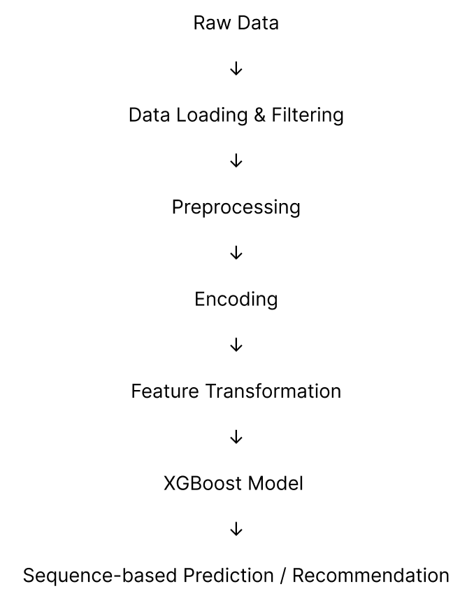
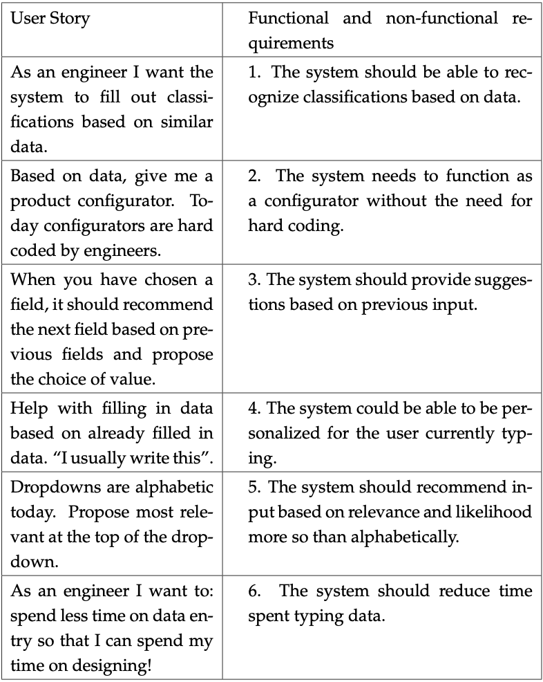

# Machine Learning Prediction Model (P9 Project)

A sequence-based machine learning approach for intelligent data entry in PLM systems.

## Overview

This project was developed in collaboration with Bluestar PLM and focuses on automating data entry in engineering systems.

The goal was to predict relevant values based on existing data, reducing manual input and improving efficiency.

## Problem Context

Engineering systems often require large amounts of manual data entry. This project explores how machine learning can assist by identifying patterns in existing data and predicting relevant inputs.

## Use Case

The system was designed to:

* Suggest relevant values based on previous inputs
* Reduce manual data entry
* Improve efficiency for engineers

## Technologies

* Python
* XGBoost
* Pandas / NumPy
* Data preprocessing & encoding

## Machine Learning Pipeline

The system follows a structured pipeline:

1. Data loading and filtering
2. Data preprocessing
3. Label encoding of categorical variables
4. Feature transformation
5. Model training using XGBoost
6. Prediction and recommendation

The final step uses sequence-based logic to recommend the next most relevant input.

## Model Approach

The system uses a sequence-based prediction approach to recommend the next relevant input based on previous selections.

This acts as a sequence-based suggestion engine for next-step prediction, enabling more intelligent and context-aware recommendations.

## Development Process

The project was developed using an iterative approach with continuous feedback from an external company.

## My Contribution

I contributed to several key parts of the system:

* Implementation of label encoding
* Development of the machine learning pipeline
* Integration of XGBoost model
* Data processing and preparation
* Visualization and communication of results

## Pipeline & System Overview

### Machine Learning Pipeline

### Development Process

### User Stories

## Results

The system demonstrated how machine learning can support data-driven decision-making.

Due to NDA restrictions, data and full implementation cannot be shared.

## Future Work

* Improve model performance
* Expand feature engineering
* Automate pipeline further
